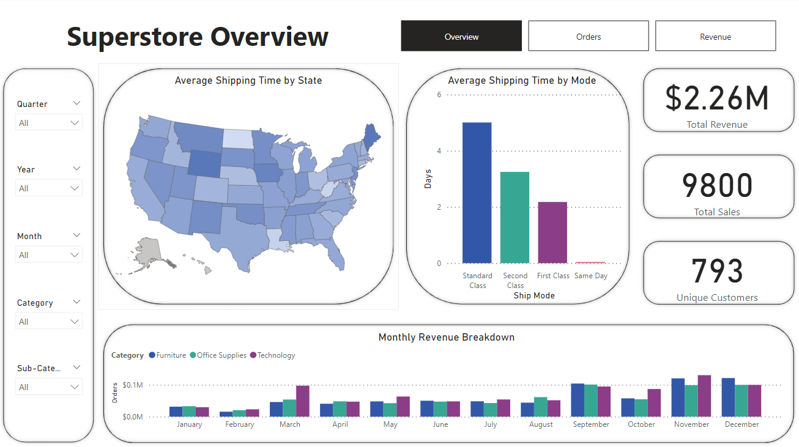
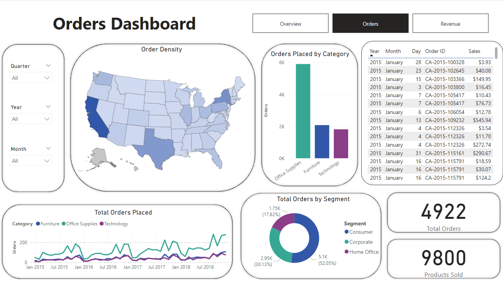
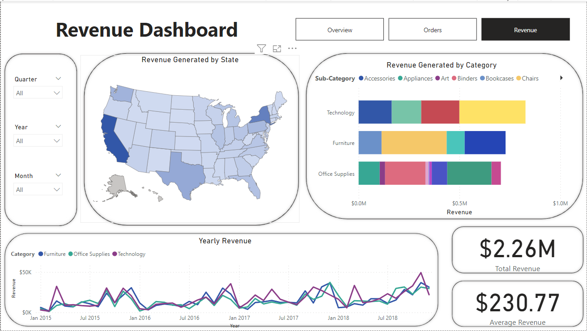

# Intro

This is a project I worked on to practice and showcase PowerBI and Data Visualization skills. I downloaded the data from kaggle.com and imported it into PowerBI. To open the file, download the PowerBI file from the projects folder by clicking download and open the file in PowerBI. 

## Personal Project, Data Visualization: Superstore Sales Dashboard

This is a project I worked on to practice and showcase PowerBI and Data Visualization skills. I downloaded the data from kaggle.com and imported it into PowerBI. 

I broke the visualization into separate parts: Overview, Orders, and Revenue.  

The goal of the overview tab is to give a general overview of the data. I started by adding cards to the screen to display the total revenue, total orders, and the number of unique customers. This will let management know how much money they made by how many orders and how many customers. I added a clustered column chart to display the revenue made by month and category to show management what months have items that sell more and generate more revenue. I wanted to display shipping time and that was not a column yet, so I went into the power query editor. The dates were not formatted correctly, so I had to split them by delimiter and re-merge the columns to get the format. I then added a column to subtract the shipping date from the order date to get the shipping time. I added a bar chart to display the average shipping time by shipping mode to display shipping speeds. I added a shape map displaying the average shipping time to display if the state the customer was in affected shipping times. To finish the overview off, I added slicers to narrow down the data, buttons to switch sheets, and played around with formatting to make the visual appealing to get the result shown below:

Moving on to the orders tab, I placed a table to display all the orders and the revenue they generated. I added a map to display order density by state to show which states order more products. I added a line graph to display the total orders placed by month to discover monthly trends and separated it by product category. Along with the line graph, I added a bar chart to display the total orders placed for each category to show what category is the top seller. I added a donut chart to display what segments are placing the orders. I added cards to display the total amount of orders and products sold. I finished the sheet off by adding slicers to narrow the data and buttons to flip between sheets, and I get the page shown below:

For the revenue tab, I added the slicers and the buttons to flip pages to start. I added a line graph showcasing yearly revenue by category to show if certain years and/or months generated more revenue. I added cards to show the total revenue generated and the average revenue generated per order. I added a map to see which states generated the company more revenue because the company can choose to focus on a certain demographic if so. I finished the page off by adding a stacked bar chart showing revenue generated by category and product type to showcase which products generated more revenue. After all of that, I get the finished sheet below:

